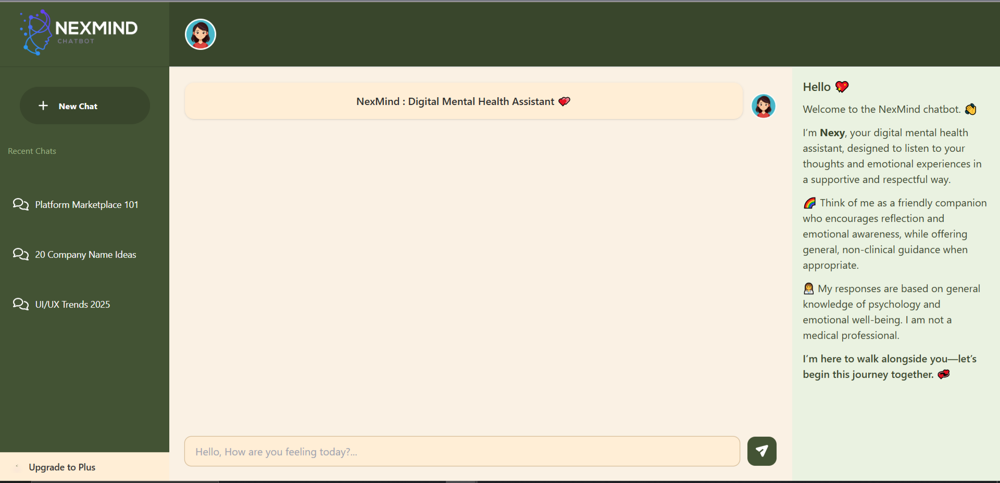
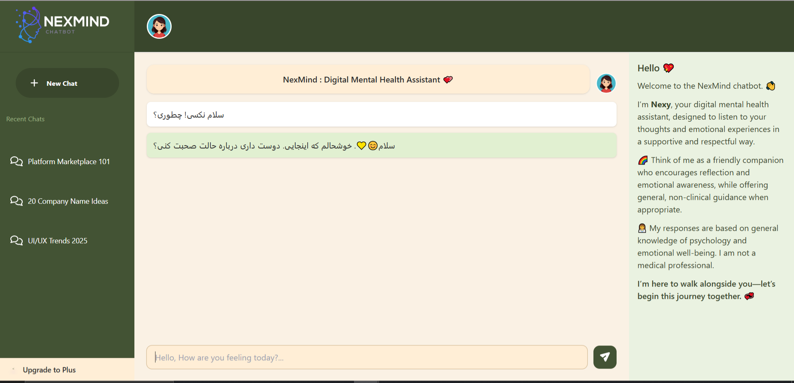
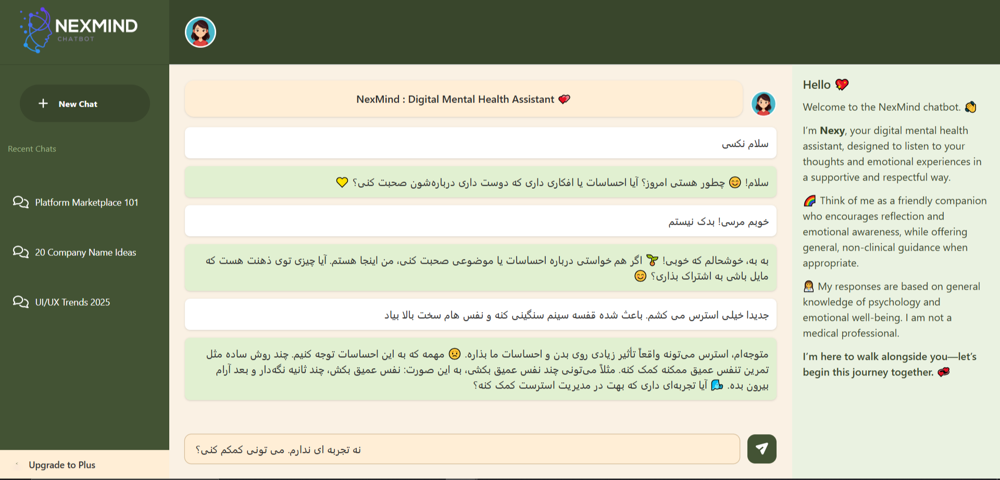
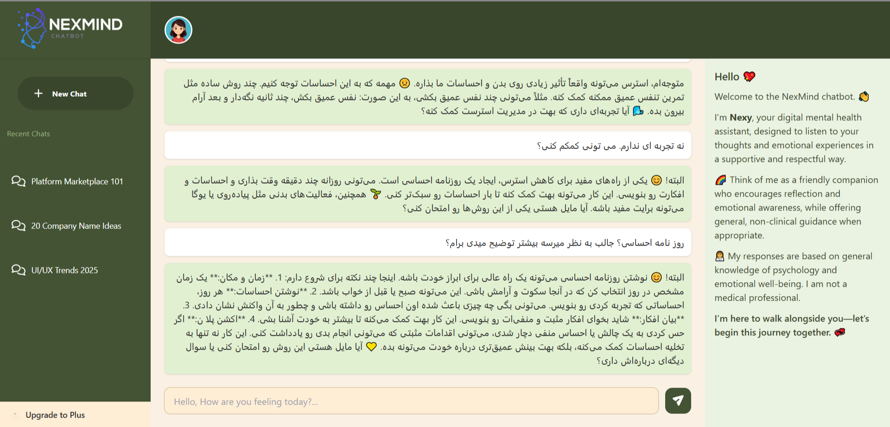
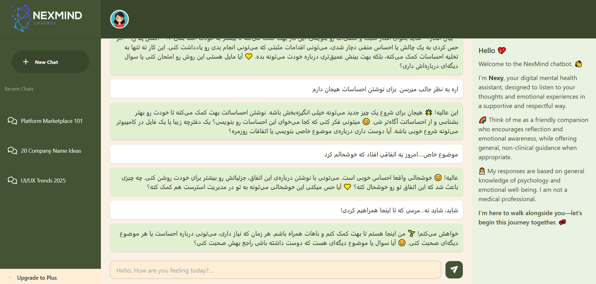

# 🧠 NexMind – Digital Mental Health Assistant
An AI-powered conversational assistant designed to provide supportive, empathetic, and non-clinical emotional interactions.

## 📘 About the Project
NexMind is a university project developed for the Artificial Intelligence Course at Islamic Azad University.
The project aims to create a digital mental health assistant capable of understanding emotional signals in user messages and generating supportive responses.
NexMind combines rule-based emotional analysis with AI-generated responses to provide a more flexible conversational experience.
⚠️ Disclaimer: NexMind is not a medical or clinical system. It does not provide diagnosis, psychotherapy, or medical treatment. It is designed only for general emotional support and educational purposes.

---

## 🧾 Project Information

Project Title: NexMind – Digital Mental Health Assistant  
Course Name: Artificial Intelligence  
University Name: Rafsanjani Complex, Islamic Azad University  
Instructor: Dr. Maryam Haji Esmaeili  

### 👥 Team Members
- Reyhane Salehi
- Mina Heidary

---

## 🤖 How It Works
NexMind uses a combination of predefined logic and AI-generated responses.
1. User Input
The user sends a message through the graphical interface.
2. Emotion Analysis
The system analyzes the user's message and looks for emotional signals using predefined patterns and keywords.
3. Response Strategy
Based on the detected emotional state and confidence level, the system determines the appropriate response strategy.
4. Response Generation
When a suitable predefined response is available, the system can use the prepared responses.
For messages requiring more flexible conversation, the system communicates with the AI model through an API.
5. Conversation
The generated response is displayed to the user through the graphical interface.
---

## 🎯 Project Objectives

- Design and implement an AI-based conversational assistant  
- Detect emotional signals from user input  
- Apply a multi-agent decision-making architecture  
- Combine rule-based responses with AI-generated responses  
- Develop a full-stack system with clear separation of concerns  
- Follow ethical and safety-aware AI design principles ⚖️  

---

## 🛠️ Technologies Used
Programming Language
Python 🐍
User Interface
Tkinter
AI / API
Language Model API
Python API integration
python-dotenv
Development Tools
Visual Studio Code
Git
GitHub

---

### 🤖 AI Logic Layer

- Implemented in Python
- Uses a multi-agent architecture
- Maintains limited conversation memory
- Applies safety checks and ethical constraints
- Decides between rule-based and AI-generated responses

---

## 🧩 Multi-Agent Design

The AI logic consists of multiple specialized agents:

Emotion Analyzer Agent  
Detects emotional keywords from user input using a transparent rule-based approach 😊😟😡  

Confidence Agent  
Estimates the confidence level of detected emotions 📊  

Strategy Agent  
Decides whether to use rule-based responses or AI-generated responses 🧠  

Safety Agent  
Detects potentially harmful or sensitive content and ensures safe responses 🚨  

Affection and Name Detection Agent  
Adjusts tone and response style when the assistant is directly addressed 💬💖  

---

## 🌐 AI Model and API Usage

The project integrates a Language Model API to generate dynamic responses when rule-based logic is insufficient.

Reasons for using a Language Model API:
- Natural and context-aware response generation  
- Ability to handle open-ended emotional expressions  
- Improved conversational flexibility  
- Effective integration with multi-agent systems  

Rule-based responses are prioritized when emotional confidence is high,  
while AI-generated responses are used as a fallback mechanism.

---

## 🛠️ Libraries and Technologies Used

### Frontend:
- React  
- JavaScript (ES6)  
- Fetch API  
- CSS and utility-based styling 🎨  

### 🖥️ Backend:
- FastAPI  
- Pydantic  
- Uvicorn  
- Python Requests  
- python-dotenv  
- CORS Middleware  

---

## 🔌 API Specification

Endpoint:  
POST /generate

Request Body:
`json
{
  "prompt": "User input message"
}

Response:
{
  "response": "Generated assistant reply"
}

## 📎 Software Engineering Principles Applied

- Separation of concerns
- Modular architecture
- Clean and readable code structure
- Scalability and extensibility
- Ethical and safety-aware AI design

## 📎 System Limitations

- The system does not provide medical or clinical advice
- Emotion detection is keyword-based and may not capture all nuances
- Conversation memory is intentionally limited
- The assistant is designed for general emotional support only
  
---
##👩🏻‍💻 My Contributions
As the Team Leader, I was responsible for coordinating the project development and contributing to the implementation of several core components.
My main contributions included:
👩🏻‍💻 Project management and team coordination
🖥️ Development and integration of the graphical user interface
🧠 Implementation of emotion-related response logic
💬 Design and organization of predefined emotional responses
🤖 Integration of AI-generated responses through an API
📝 Implementation and improvement of conversation memory
🛡️ Development of response-safety and conversational constraints
🔗 Integration of the UI, application logic, and API components
🧪 Debugging and testing different conversation scenarios
✨ Improving the conversational experience and response behavior

---
## ✨ How to Run the Project
Backend:

pip install -r requirements.txt  

uvicorn server:app --reload

Frontend:

npm install  

npm start

---
##⚠️ Limitations

Emotion detection is based on predefined patterns and may not understand every emotional nuance.

The system is not a replacement for professional mental health services.

Conversation memory is intentionally limited.

AI-generated responses depend on the external language model API.

Internet access is required for AI-generated responses.

---
## ⚜️ Screenshots

### Chat Interface

### Running Chat Interface

### AI Responding to Stress

### AI Guidance

### Emotional Reflection

## Conclusion

NexMind demonstrates the practical application of artificial intelligence concepts, multi-agent systems, and full-stack software engineering.  

The project emphasizes emotional awareness, safety, and modular AI design within an ethical framework.

